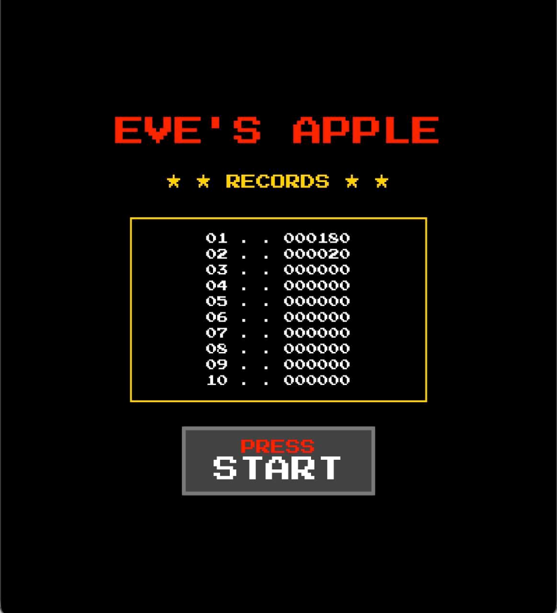
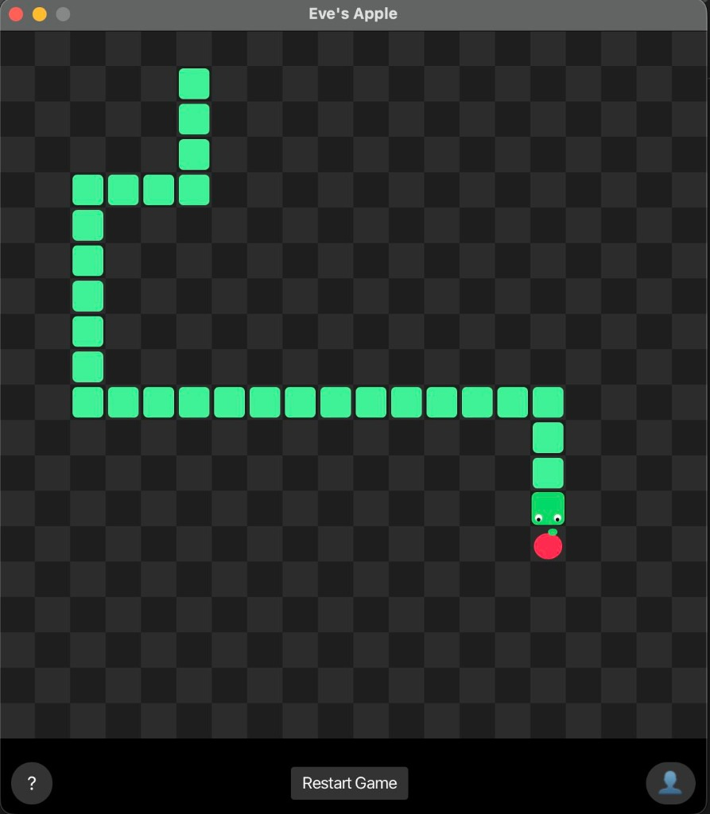

# 🐍 Eve's Apple

A modern, highly-polished, and high-performance desktop Snake engine built from scratch in Java.




## 🚀 Installation & How to Play

**Eve's Apple** is not just a script; it is a full, standalone desktop application. 

### 💻 macOS Installation
1. Download or clone this repository.
2. Double-click **`Eve's Apple.app`** to launch.
3. *Note:* Because this is an independently built application, macOS Gatekeeper may warn about an "unidentified developer." To run it, simply **Right-Click** the app and select **Open**, or go to *System Settings > Privacy & Security* and select *Open Anyway*.

### 🪟 Windows & 🐧 Linux Installation
Because the core engine is powered by Java, the application can be run directly on any OS!
1. Download or clone this repository.
2. Ensure you have **Java 17+** installed.
3. Open your command line and run the application engine using the bundled libraries:
   ```bash
   java --module-path "Eve's Apple.app/Contents/Resources/app/lib" --add-modules javafx.controls,javafx.graphics -cp "Eve's Apple.app/Contents/Resources/app/snake-apple-1.0-SNAPSHOT.jar" com.snake.ui.Main
   ```

## 🎮 Controls
- **Movement:** `W` `A` `S` `D`  *or*  `Arrow Keys`
- **Pause / Play:** `Spacebar`

---
*Built with precision and ❤️ for cross-platform play.*
